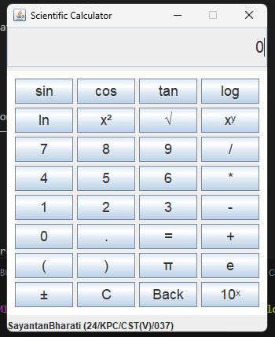

# Scientific Calculator - Java Application

## Overview

This is a scientific calculator application built using Java. It provides various mathematical operations and a user-friendly interface for performing calculations. The project follows a structured directory format and includes source code, binaries, and a script to run the application.

# Scientific Calculator Project

A Java-based Scientific Calculator with a graphical user interface (GUI) built using Swing. This project demonstrates object-oriented programming principles and event-driven design to perform standard and scientific mathematical operations.

---

## 3. Introduction

The Scientific Calculator project is a desktop application developed in Java, designed to provide users with a reliable and intuitive tool for performing both basic and advanced mathematical computations. Utilizing the Java Swing library, the calculator features a user-friendly graphical interface that includes a display panel and a button panel for input. The project encapsulates core programming concepts such as modularity, encapsulation, and event handling, making it an excellent example of software engineering principles in action. This calculator supports operations like addition, subtraction, multiplication, division, as well as scientific functions (e.g., trigonometry, logarithms), catering to students, professionals, and enthusiasts alike.

---

## 4. Foreword

This project represents a significant milestone in my journey as a programmer, blending theoretical knowledge with practical application. The development of this Scientific Calculator in Java allowed me to explore the intricacies of GUI programming and deepen my understanding of object-oriented design. By creating a fully functional calculator with a clean interface and robust logic, I aimed to craft a tool that is both practical and educational. This document outlines the purpose, structure, and goals of the project, serving as a comprehensive guide for anyone reviewing or extending this work. I hope this project inspires others to experiment with Java and build their own innovative solutions.

---

## 5. Acknowledgement

I would like to express my heartfelt gratitude to those who have supported me throughout the development of this Scientific Calculator project. Firstly, I extend my thanks to my instructors for providing me with the foundational knowledge of Java and GUI programming, which made this project possible. I am also grateful to my peers for their constructive feedback and encouragement during the coding and debugging phases. Additionally, I acknowledge the open-source community and online resources that offered valuable insights into Java Swing and best practices in software development. Finally, I thank my family for their unwavering support and patience, which kept me motivated to complete this assignment.

---

## 6. Objective

The primary objective of this project was to design and implement a fully functional Scientific Calculator using Java, with a focus on creating an efficient and user-friendly application. Specific goals included:

- **Mastering GUI Development:** Leverage Java Swing to build an interactive and visually appealing interface.
- **Implementing Core Logic:** Develop a robust backend (`ScientificCalculatorLogic`) to handle both basic arithmetic and advanced scientific operations accurately.
- **Enhancing Programming Skills:** Apply object-oriented principles such as encapsulation and modularity to ensure the code is reusable and maintainable.
- **Assignment Fulfillment:** Meet the requirements of the academic assignment by showcasing technical proficiency and creativity in software design.

This project aimed to bridge theoretical concepts with practical implementation, resulting in a tool that is both educational and functional.

---

## Project Structure

```
scientific-calculator/   
├── bin/
├── lib/  
├── src/   
│   └── main/
│       ├── java/
│       │   └── com/
│       │       └── calculator/
│       │           ├── logic/
│       │           │   └── ScientificCalculatorLogic.java
│       │           ├── ui/
│       │           │   ├── ButtonPanel.java
│       │           │   ├── CalculatorUI.java
│       │           │   └── Display.java
│       │           └── Main.java 
│       └── resources/
│          └── calculator.png
├── .gitignore    
├── run.sh          
```

## Files Description

- **src/main/java/com/calculator/logic/ScientificCalculatorLogic.java** - Implements various scientific and basic arithmetic operations.
- **src/main/java/com/calculator/ui/CalculatorUI.java** - The main class that initializes and runs the calculator's user interface.
- **src/main/java/com/calculator/ui/ButtonPanel.java** - Manages the button layout and actions for the calculator.
- **src/main/java/com/calculator/ui/Display.java** - Manages the calculator's display area.
- **src/main/java/com/calculator/Main.java** - The entry point of the application.
- **bin/** - Contains compiled `.class` files for execution.
- **lib/** - Contains any required external libraries or JAR files.
- **src/main/resources/calculator.png** - The icon or image used in the application.
- **run.sh** - A script to run the application from the terminal.
- **.gitignore** - Specifies files and directories that Git should ignore.

## Installation & Usage

### Prerequisites

- Java Development Kit (JDK) installed (Version 8 or higher)
- A terminal or command prompt


### Running the Application

Simply execute the application using:

```bash
./run.sh
```

## Features

- Basic Arithmetic Operations: Addition (`+`), Subtraction (`-`), Multiplication (`*`), Division (`/`)
- Scientific functions:
  - Exponents & Roots: Square (`x²`), Square root (`√`), Power (`xʸ`), Exponential (`10ˣ`)
  - Logarithmic Functions: Logarithm (`log`), Natural logarithm (`ln`)
  - Trigonometric Functions: Sine (`sin`), Cosine (`cos`), Tangent (`tan`)
  - Constants & Special Functions: Pi (`π`), Euler’s number (`e`)
  - Sign Operations: Negation (`±`)
- Memory functions:
  - Clear (`C`), Backspace (`Back`)
- User-friendly with well-organized buttons
- Command-line execution support for extended functionality

## Image


