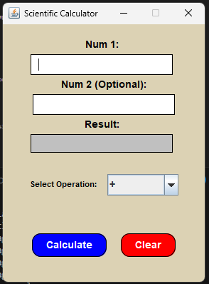

# Scientific Calculator - Java Application

## Overview

This is a scientific calculator application built using Java. It provides various mathematical operations and a user-friendly interface for performing calculations. The project follows a structured directory format and includes source code, binaries, and a script to run the application.

## Project Structure

```
scientific-calculator/
│-- bin/               
│-- src/                
│   │-- CalculatorOperations.java  
│   │-- Main.java                  
│   │-- UIManager.java              
│-- run.sh              
```

## Files Description

- **CalculatorOperations.java** - Implements various scientific and basic arithmetic operations.
- **Main.java** - The main class that initializes and runs the calculator.
- **UIManager.java** - Manages the user interface and handles interactions.
- **bin/** - Contains compiled `.class` files for execution.
- **src/** - Contains the raw source code files.
- **run.sh** - A script to run the application from the terminal.

## Installation & Usage

### Prerequisites

- Java Development Kit (JDK) installed (Version 8 or higher)
- A terminal or command prompt


### Running the Application

Simply execute the application using:

```bash
./run.sh
```

## Features

- Basic arithmetic operations (+, -, *, /, %)
- Scientific functions:
  - Exponentiation (`^`), Square root (`√`)
  - Logarithm (`log`, `ln`), Exponential (`e^x`)
  - Trigonometric functions (`sin`, `cos`, `tan`, `asin`, `acos`, `atan`)
  - Hyperbolic functions (`sinh`, `cosh`, `tanh`)
  - Absolute value (`abs`), Factorial (`factorial`)
- Memory functions:
  - Store (`store`), Recall (`recall`), Clear (`clearM`)
- User-friendly interface
- Command-line execution support

## Image


